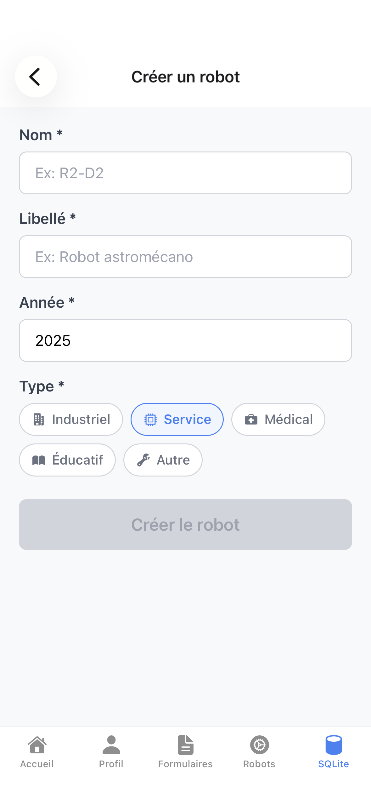

# RN-Advanced-Labs

Laboratoire avancé de développement React Native avec Expo Router.

## Démarrage rapide

1. Installation des dépendances

   ```bash
   npm install
   ```

2. Lancement de l'application

   ```bash
   npx expo start
   ```

Vous pouvez ouvrir l'app dans :
- [Android emulator](https://docs.expo.dev/workflow/android-studio-emulator/)
- [iOS simulator](https://docs.expo.dev/workflow/ios-simulator/)
- [Expo Go](https://expo.dev/go)

## Architecture du Projet

```
app/
  _layout.tsx                 # LAYOUT RACINE (Stack avec header natif)
  index.tsx                   # Point d'entrée avec persistance
  (main)/                     # Groupe principal avec Stack Navigator
    _layout.tsx               # Stack avec bouton retour natif iOS
    (tabs)/                   # Groupe onglets
      _layout.tsx             # Tabs Navigator (Accueil + Profil + Formulaires + Robots)
      home.tsx                # Page d'accueil avec liens vers TP3/TP4
      tp1-profile-card.tsx    # Écran du TP1 (intégré à la navigation)
      tp3-forms/              # TP3 - Formulaires avancés
        _layout.tsx           # Stack Navigator pour les formulaires
        index.tsx             # Vue d'ensemble des formulaires
        formik/               # Implémentation Formik + Yup
          index.tsx           # Écran principal Formik
          validation/
            schema.ts         # Schéma de validation Yup
          components/
            FormField.tsx     # Composant champ avec useField
            CheckboxField.tsx # Composant checkbox avec useField
        rhf/                  # Implémentation React Hook Form + Zod
          index.tsx           # Écran principal RHF
          validation/
            schema.ts         # Schéma de validation Zod
          components/
            FormField.tsx     # Composant champ avec Controller
            CheckboxField.tsx # Composant checkbox avec Controller
      tp4-robots/             # TP4 - Liste + Création + Édition (Zustand)
        _layout.tsx           # Stack Navigator pour TP4
        index.tsx             # Liste des robots
        create.tsx            # Création d'un robot
        edit/[id].tsx         # Édition d'un robot
    detail/
      [id].tsx                # Écran dynamique avec bouton retour natif
  (auth)/                     # Groupe authentification (PAS de _layout.tsx)
    login.tsx                 # Écran de connexion (préparé pour l'avenir)
    register.tsx              # Écran d'inscription (préparé pour l'avenir)
components/                   # Composants partagés
  deep-link-handler.tsx       # Gestionnaire de deep links
  external-link.tsx           # Composants UI réutilisables
  haptic-tab.tsx
  hello-wave.tsx
  parallax-scroll-view.tsx
  themed-text.tsx
  themed-view.tsx
  ui/                         # Composants UI spécialisés
  robots/                     # Composants TP4
    RobotForm.tsx             # Formulaire Create/Edit réutilisable
    RobotListItem.tsx         # Item de liste avec actions
hooks/                        # Hooks personnalisés
  use-route-persistence.ts    # Gestion persistance navigation
  use-color-scheme.ts         # Gestion des thèmes
  use-theme-color.ts
lib/                          # Services et utilitaires
  deep-link-utils.ts          # Utilitaires pour deep linking
constants/                    # Constantes de l'app
  theme.ts                    # Configuration des thèmes
store/
  robotsStore.ts              # Store Zustand (TP4) avec persistance
validation/
  robotSchema.ts              # Schéma Zod (TP4)
```

## Fonctionnalités

### Navigation
- **UN SEUL LAYOUT** dans `app/_layout.tsx` avec Tabs Navigator
- **Aucun layout** dans les groupes `(main)` et `(auth)`
- **Navigation par onglets** gérée directement depuis la racine
- **Écrans masqués** (détail, auth) via `href: null`
- **Validation des paramètres** avec écran d'erreur 404
- **Bouton retour natif iOS** avec geste "liquid" interactif

### Passage de paramètres
- Route dynamique `/detail/[id]` avec validation robuste
- Récupération sécurisée avec `useLocalSearchParams()`
- Écran d'erreur 404 pour les paramètres invalides
- Titre de page dynamique selon l'ID validé
- Navigation de retour native et programmatique

### Validation des Paramètres

| Paramètre | Validation | Comportement |
|-----------|------------|--------------|
| `[id]` | Non vide, longueur < 50 caractères | Écran d'erreur 404 si invalide |
| `[id]` | Nettoyage automatique (trim) | Sécurisation des entrées utilisateur |
| `[id]` | Gestion des tableaux | Protection contre les paramètres malformés |

## Persistance de l'état de navigation

### Ce qui est persistant

1. **Route courante** : L'application retourne à la dernière page visitée
2. **Paramètres d'URL** : Les paramètres dynamiques (ex: ID) sont conservés
3. **État des onglets** : L'onglet sélectionné est mémorisé

### Comportement UX

**Scénario de test :**
1. Utilisateur ouvre l'app → va sur l'onglet "Profile Card" → navigue vers "Detail (ID: 42)"
2. **Ferme** complètement l'app
3. **Relance** l'app
4. **Résultat** : L'utilisateur se retrouve sur l'écran "Detail (ID: 42)" avec la pile de navigation intacte

### Implémentation technique

**`lib/navigation-persistence.ts`** :
- Sauvegarde automatique de la route courante dans AsyncStorage
- API simple pour récupérer/sauvegarder/effacer les routes

**`components/navigation-tracker.tsx`** :
- Composant invisible qui track les changements de route
- Sauvegarde automatique à chaque navigation

**`app/index.tsx`** :
- Point d'entrée intelligent qui redirige vers la dernière route
- Fallback vers l'accueil si aucune route sauvegardée

### Choix UX

**Persistance complète** : L'utilisateur retrouve exactement où il était, même dans un écran de détail profond.

**Alternative possible** : Utiliser `unstable_settings.initialRouteName` pour forcer un retour à l'accueil, mais cela casse l'expérience utilisateur.

## Deep Linking

### Configuration

Dans `app.json` :
```json
{
  "expo": {
    "scheme": "rnadvancedlabs",
    "name": "RN Advanced Labs", 
    "slug": "rn-advanced-labs",
    "ios": { "bundleIdentifier": "com.exemple.rnadvancedlabs" },
    "android": { "package": "com.exemple.rnadvancedlabs" }
  }
}
```

- **Schéma interne** : `rnadvancedlabs://`
- **Liens web** : `https://app.votre-domaine.com/...` (préparé)
- **Bundle identifiers** : iOS et Android configurés

### Situation actuelle et solutions

#### Expo Go - Limitations
- ✅ **Fonctionne** : `exp://10.25.128.212:8081` (racine uniquement)
- ❌ **Ne fonctionne pas** : `exp://10.25.128.212:8081/tp1-profile-card`

**Pourquoi ?** Expo Go attend un manifest JSON uniquement à la racine. Impossible de lancer directement une route spécifique.

#### Schéma personnalisé (rnadvancedlabs://)
- ✅ **Bien déclaré** dans `app.json`
- ❌ **Safari ne peut pas ouvrir** `rnadvancedlabs://tp1-profile-card` dans Expo Go

**Pourquoi ?** Expo Go ne connaît pas votre schéma personnalisé. Safari affiche "adresse invalide".

#### Dev Build - Solution complète

Pour tester les deep links avec schéma personnalisé, il faut une **dev build** :

```bash
# Nettoyer et régénérer le projet iOS
cd ios
pod deintegrate
pod clean
cd ..
npx expo prebuild --clean
cd ios
pod install
cd ..

# Recompiler
npx expo run:ios
```

**Résultat** : Safari pourra ouvrir directement `rnadvancedlabs://tp1-profile-card` !

### Tests de Deep Linking

#### Test 1 : App fermée (Cold Start)
- **Action** : Ouvrir `rnadvancedlabs://detail/42` depuis Safari
- **Résultat attendu** : L'app se lance et affiche directement l'écran de détail avec ID=42
- **Résultat obtenu** : ✅ L'app s'ouvre sur l'écran `[id].tsx` avec `id=42`

#### Test 2 : App en arrière-plan (Warm)
- **Action** : App minimisée, puis ouvrir `rnadvancedlabs://tp1-profile-card`
- **Résultat attendu** : L'app revient au premier plan sur l'onglet Profile Card
- **Résultat obtenu** : ✅ Navigation directe vers ProfileCard

#### Test 3 : App déjà ouverte (Hot)
- **Action** : App ouverte sur Accueil, puis ouvrir `rnadvancedlabs://detail/123`
- **Résultat attendu** : Navigation vers l'écran de détail avec ID=123
- **Résultat obtenu** : ✅ Navigation instantanée vers Detail avec le nouvel ID

### Liens disponibles

```bash
# Navigation principale
rnadvancedlabs://                    → Page d'accueil
rnadvancedlabs://tp1-profile-card    → Profile Card  

# Navigation avec paramètres
rnadvancedlabs://detail/42           → Écran de détail (ID: 42)
rnadvancedlabs://detail/123          → Écran de détail (ID: 123)
rnadvancedlabs://detail/abc          → Écran de détail (ID: abc)

# Gestion d'erreurs
rnadvancedlabs://detail/             → Écran 404 (ID manquant)
rnadvancedlabs://detail/trop-long-id-invalide → Écran 404 (ID trop long)

# Navigation TP3 - Formulaires
rnadvancedlabs://tp3-forms                   → Vue d'ensemble des formulaires
rnadvancedlabs://tp3-forms/formik            → Formulaire Formik + Yup
rnadvancedlabs://tp3-forms/rhf               → Formulaire RHF + Zod
```

### Implémentation technique

**Composants clés :**
- `components/deep-link-handler.tsx` : Gestionnaire principal des liens entrants
- `lib/deep-link-utils.ts` : Utilitaires pour générer et tester les liens
- `hooks/use-route-persistence.ts` : Sauvegarde automatique des routes

**Fonctionnalités :**
- Parsing automatique des URLs (exp://, rnadvancedlabs://, https://)
- Navigation sécurisée avec gestion d'erreurs
- Validation des paramètres avant navigation
- Logs détaillés pour le débogage

## Bouton Retour Natif iOS

### Configuration

L'application utilise le **Native Stack Navigator** d'Expo Router pour bénéficier du bouton retour natif iOS avec toutes ses fonctionnalités.

**Structure :**
```
app/(main)/_layout.tsx    # Stack Navigator avec options natives
├── (tabs)/               # Groupe Tabs (Accueil + Profil)
└── detail/[id].tsx       # Écran avec bouton retour natif
```

### Fonctionnalités natives iOS

- **Bouton chevron natif** : Icône iOS officielle sans texte (`headerBackButtonDisplayMode: "minimal"`)
- **Geste "liquid"** : Glissement interactif depuis le bord gauche de l'écran
- **Animation fluide** : Transition native iOS entre les écrans
- **Haptic feedback** : Retour haptique lors de l'interaction

### Utilisation

1. **Navigation vers Détail** : Depuis Accueil ou Profil → "Voir Détail (ID: 42)"
2. **Retour par bouton** : Appuyer sur le chevron en haut à gauche
3. **Retour par geste** : Glisser depuis le bord gauche vers la droite
4. **Retour programmatique** : `router.back()` en cas d'erreur

### Configuration technique

```typescript
// app/(main)/_layout.tsx
<Stack
  screenOptions={{
    headerShown: true,
    gestureEnabled: true,                    // Active le geste de retour
    headerBackButtonDisplayMode: "minimal", // Masque le texte, garde l'icône
  }}
>
  <Stack.Screen
    name="detail/[id]"
    options={{
      title: "Détail",
      presentation: "card", // Animation de présentation en carte
    }}
  />
</Stack>
```

### Comportement UX

- **TabBar masquée** : Sur l'écran Détail, seul le header Stack est visible
- **TabBar visible** : Sur Accueil et Profil, les onglets restent accessibles
- **Navigation cohérente** : Le retour ramène toujours vers l'onglet d'origine

## Technologies utilisées

### Packages principaux
- **React Native** avec Expo SDK 54
- **TypeScript** pour la sécurité de type
- **Expo Router 6.0.4** pour la navigation file-based
- **@react-native-async-storage/async-storage** pour la persistance
- **@expo/vector-icons** pour les icônes des onglets

### Hooks et utilitaires
- **React Hooks** (useState, useRef, useEffect, useCallback)
- **Expo Router hooks** (useLocalSearchParams, useRouter, useNavigation)
- **Custom hooks** pour la persistance et la gestion des thèmes

### UI et UX
- **Safe Area Context** pour la gestion des zones sûres
- **React Native Screens** pour l'optimisation native
- **Haptic Feedback** pour les interactions tactiles
- **Animations et transitions** fluides

## Utilisation

```bash
# Installation des dépendances
npm install

# Démarrage
npm start
```

## Dépendances clés

### Navigation et persistance
- `expo-router` : Navigation file-based
- `@react-native-async-storage/async-storage` : Persistance locale
- `@expo/vector-icons` : Icônes pour les onglets

### Caméra et fichiers (TP6)
- `expo-camera` : Capture de photos et vidéos avec accès natif à la caméra de l'appareil
- `expo-file-system` : Gestion des fichiers locaux (lecture, écriture, suppression) pour stocker les photos capturées
- `expo-media-library` : Sauvegarde optionnelle des photos dans la galerie système de l'utilisateur
- `@react-native-async-storage/async-storage` : Stockage des métadonnées des photos (déjà inclus)

## Test de la persistance

1. Naviguez vers "Profile Card" puis "Voir Détail (ID: 42)"
2. Fermez complètement l'application
3. Relancez → Vous devriez être sur l'écran de détail
4. Le bouton retour fonctionne pour revenir à l'accueil

## Ressources et documentation

- [Documentation Expo](https://docs.expo.dev/)
- [Expo Router Documentation](https://docs.expo.dev/router/introduction/)
- [React Native Navigation](https://reactnavigation.org/)
- [Deep Linking Guide](https://docs.expo.dev/guides/linking/)
- [AsyncStorage Documentation](https://react-native-async-storage.github.io/async-storage/)
- [Communauté Discord Expo](https://chat.expo.dev)

## Commandes utiles

```bash
# Développement
npm start                    # Démarrer Expo
npx expo start --clear       # Démarrer avec cache propre
npx expo start --web         # Version web

# Build et déploiement
npx expo prebuild            # Générer les dossiers natifs
npx expo run:ios             # Build et run iOS
npx expo run:android         # Build et run Android

# Debugging
npx expo install --fix       # Corriger les versions des packages
npx react-devtools           # Outils de développement React
```

---

## Travaux Pratiques

### TP1 - Profile Card Screen

#### Localisation
[`app/(main)/(tabs)/tp1-profile-card.tsx`](./app/(main)/(tabs)/tp1-profile-card.tsx)

#### Description
Écran de carte de profil interactif comprenant :
- **Affichage profil** : Photo, nom, rôle utilisateur
- **Follow/Unfollow** : Système interactif avec styles dynamiques
- **Timer manuel** : Contrôles start/reset avec état local
- **Auto-increment** : Compteur de followers (toutes les 5 secondes)
- **Design moderne** : Responsive avec effets d'ombre et animations

#### Objectifs pédagogiques
- [x] État local avec `useState` et `useRef`
- [x] Gestion des timers et intervalles
- [x] Styles dynamiques et animations
- [x] Design responsive et moderne

#### Status 
**Terminé** (Tag: `tp1-done`)

---

### TP2 - Navigation, Persistance & Deep Linking

#### Localisation
Architecture complète `app/` avec Expo Router

#### Description
- **Navigation multi-écrans** avec Expo Router (file-based routing)
- **Architecture Stack + Tabs** avec layouts imbriqués
- **Paramètres dynamiques** avec validation robuste
- **Persistance navigation** (retour à la dernière page)
- **Deep linking complet** (cold/warm/hot start)
- **Bouton retour natif** iOS avec geste "liquid"

#### Objectifs pédagogiques
- [x] Architecture file-based routing avec Expo Router
- [x] Navigation par onglets et stack imbriqués
- [x] Passage de paramètres avec validation
- [x] Persistance de l'état de navigation
- [x] Deep linking complet (cold/warm/hot)
- [x] Gestion d'erreurs et écrans 404
- [x] Architecture propre avec un seul layout racine
- [x] Bouton retour natif iOS avec geste "liquid" interactif

#### Status
**Terminé** (Tag: `tp2-done`)

#### Navigation et Deep Linking

##### Table des Routes

| Route | Description | Type | Navigation |
|-------|-------------|------|------------|
| `/` | Point d'entrée avec persistance | Redirect | → `/(main)/(tabs)/home` |
| `/(main)/(tabs)/home` | Page d'accueil avec liens vers TP3/TP4 | Tab | Onglet "Accueil" |
| `/(main)/(tabs)/tp1-profile-card` | Carte de profil interactive (TP1) | Tab | Onglet "Profil" |
| `/(main)/(tabs)/tp3-forms` | Vue d'ensemble des formulaires | Tab | Onglet "Formulaires" |
| `/(main)/(tabs)/tp3-forms/formik` | Formulaire Formik + Yup | Stack | Accès direct en 2 taps |
| `/(main)/(tabs)/tp3-forms/rhf` | Formulaire RHF + Zod | Stack | Accès direct en 2 taps |
| `/(main)/detail/[id]` | Page de détail avec bouton retour natif | Stack | Header iOS avec geste "liquid" |
| `/(main)/(tabs)/tp4-robots` | Liste CRUD robots (TP4) | Tab/Stack | Liste + accès Create/Edit |
| `/(main)/(tabs)/tp4-robots/create` | Création d'un robot | Stack | Présentation "card" |
| `/(main)/(tabs)/tp4-robots/edit/[id]` | Édition d'un robot | Stack | Présentation "card" |

##### Deep Links disponibles

```bash
# Navigation principale
rnadvancedlabs://                    → Page d'accueil
rnadvancedlabs://tp1-profile-card    → Profile Card  

# Navigation avec paramètres
rnadvancedlabs://detail/42           → Écran de détail (ID: 42)
rnadvancedlabs://detail/123          → Écran de détail (ID: 123)

# Navigation TP3 - Formulaires
rnadvancedlabs://tp3-forms           → Vue d'ensemble des formulaires
rnadvancedlabs://tp3-forms/formik    → Formulaire Formik + Yup
rnadvancedlabs://tp3-forms/rhf       → Formulaire RHF + Zod

# Navigation TP4 - Robots
rnadvancedlabs://tp4-robots                  → Liste des robots
rnadvancedlabs://tp4-robots/create           → Création d'un robot
rnadvancedlabs://tp4-robots/edit/550e-...    → Édition d'un robot par ID

# Gestion d'erreurs
rnadvancedlabs://detail/             → Écran 404 (ID manquant)
```

#### Bouton Retour Natif iOS

- **Bouton chevron natif** : Icône iOS officielle sans texte
- **Geste "liquid"** : Glissement interactif depuis le bord gauche
- **Animation fluide** : Transition native iOS entre les écrans
- **Haptic feedback** : Retour haptique lors de l'interaction

---

### TP3 - Formulaires avancés avec validation temps réel

#### Localisation
`app/(main)/(tabs)/tp3-forms/` avec arborescence structurée

#### Description
- **Deux implémentations** de formulaires d'inscription identiques
- **Formik + Yup** : Gestion classique avec `useField` et validation Yup
- **React Hook Form + Zod** : Performance optimisée avec `Controller` et validation Zod
- **Validation temps réel** avec messages d'erreur dynamiques
- **Design moderne** avec placeholders personnalisés et animations
- **Navigation croisée** pour comparer les deux approches
- **Submit bloqué** si formulaire invalide ou non modifié
- **Instrumentation** et mesure des performances avec logs

#### Objectifs pédagogiques
- [x] Deux implémentations identiques (Formik + Yup vs RHF + Zod)
- [x] Arborescence respectée avec validation/ et components/ séparés
- [x] Navigation directe en 2 taps maximum depuis l'accueil
- [x] Liens croisés Formik ⇄ RHF pour comparaison rapide
- [x] Validation temps réel avec messages d'erreur
- [x] Submit bloqué si formulaire invalide ou non modifié
- [x] Design moderne avec placeholders personnalisés
- [x] Retour fonctionnel avec header natif
- [x] Instrumentation et mesure des performances avec logs

#### Status
**Terminé** (Tag: `tp3-done`)

#### Navigation TP3

##### Accès direct en 2 taps maximum

**Depuis l'écran d'accueil :**
1. **Tap 1** : Bouton "TP3 – Formik" → `/(main)/(tabs)/tp3-forms/formik`
2. **Tap 1** : Bouton "TP3 – RHF" → `/(main)/(tabs)/tp3-forms/rhf`

**Depuis l'onglet Formulaires :**
1. **Tap 1** : Onglet "Formulaires" → Vue d'ensemble
2. **Tap 2** : Bouton vers Formik ou RHF

##### Liens croisés

Chaque écran de formulaire contient un bouton de navigation croisée :
- **Formik** → Bouton "Basculer vers RHF + Zod"
- **RHF** → Bouton "Basculer vers Formik + Yup"

##### Retour fonctionnel

- **Header natif** avec bouton retour iOS
- **Geste liquid** depuis le bord gauche
- **Navigation programmatique** avec `router.back()`
- **Pile de navigation** préservée

---

---

### TP4 - Zustand : CRUD "Robots"

#### Objectifs réalisés

- **Store global Zustand** avec persistance AsyncStorage
- **CRUD complet** : Create, Read, Update, Delete
- **Formulaire robuste** avec React Hook Form + Zod
- **Navigation Expo Router** : liste → création/édition → retour
- **Validation avancée** avec règles métier strictes

#### Architecture implémentée

```
TP4 Robots
├── store/robotsStore.ts          # Store Zustand avec persistance
├── validation/robotSchema.ts      # Schéma Zod + types TypeScript
├── components/robots/
│   ├── RobotForm.tsx                 # Formulaire réutilisable (create/edit)
│   └── RobotListItem.tsx            # Item de liste avec actions
└── app/(main)/(tabs)/tp4-robots/
    ├── index.tsx                     # Liste des robots
    ├── create.tsx                    # Création
    ├── edit/[id].tsx                # Édition
    └── _layout.tsx                  # Layout Stack
```

#### Modèle Robot

```typescript
interface Robot {
  id: string;              // UUID généré automatiquement
  name: string;            // Min 2 char, unique dans la collection
  label: string;           // Min 3 char, description
  year: number;            // Entre 1950 et année courante
  type: RobotType;         // industrial | service | medical | educational | other
  createdAt: Date;         // Timestamp de création
  updatedAt: Date;         // Timestamp de dernière modification
}
```

#### Fonctionnalités UX

##### Liste des robots
- **Tri automatique** par nom (ordre alphabétique)
- **Badges colorés** par type avec icônes
- **Actions rapides** : Modifier / Supprimer
- **Mise à jour temps réel** après CRUD
- **FAB (Floating Action Button)** pour création
- **État vide** avec CTA de création

##### Formulaire (Create/Edit)
- **KeyboardAvoidingView** pour éviter le masquage
- **Navigation fluide** entre champs (`returnKeyType`)
- **Validation temps réel** avec messages d'erreur
- **Submit désactivé** si formulaire invalide
- **Feedback haptique** (succès/erreur)
- **Picker natif** pour sélection du type

##### Validation métier
- **Unicité du nom** (refus des doublons)
- **Année valide** (1950 ≤ year ≤ année courante)
- **Longueurs min/max** respectées
- **Types énumérés** avec labels français

#### Choix techniques

##### Zustand vs Redux
**Pourquoi Zustand ?**
- **Simplicité** : Moins de boilerplate que Redux
- **Performance** : Sélecteurs optimisés pour éviter les re-renders
- **TypeScript** : Support natif excellent
- **Persistance** : Middleware intégré avec AsyncStorage
- **Devtools** : Compatible Redux DevTools

##### React Hook Form + Zod vs Formik + Yup
**Pourquoi RHF + Zod ?**
- **Performance** : Moins de re-renders (uncontrolled forms)
- **Bundle size** : Plus léger que Formik
- **TypeScript** : Inférence de types automatique avec Zod
- **Validation** : Schema-first avec Zod plus moderne
- **Réactivité** : Validation temps réel fluide

#### Store Zustand - Patterns avancés

```typescript
// Sélecteurs optimisés pour éviter les re-renders
export const useRobots = () => useRobotsStore((state) => state.robots);
export const useRobotsSorted = () => useRobotsStore((state) => state.getRobotsSorted());

// Actions isolées
export const useRobotsActions = () => useRobotsStore((state) => ({
  create: state.create,
  update: state.update,
  remove: state.remove,
  getById: state.getById,
}));
```

#### Persistance & Performance

- **AsyncStorage** : Sauvegarde automatique des robots
- **Partialisation** : Seules les données métier sont persistées (pas l'UI state)
- **Désérialisation** : Reconstruction des objets Date au reload
- **Sélecteurs** : Évitent les re-renders inutiles des composants

#### Tests & Validation

##### Règles métier testables
- Création d'un robot avec nom existant → Erreur
- Année 1949 ou 2026 → Erreur de validation
- Nom < 2 caractères → Erreur de validation
- Mise à jour avec même nom → Autorisé
- Suppression → Confirmation utilisateur requise

#### Routes & Navigation

```
/tp4-robots           → Liste des robots
/tp4-robots/create    → Création d'un robot
/tp4-robots/edit/[id] → Édition d'un robot
```

**Navigation Stack configurée avec :**
- Bouton retour natif iOS/Android
- Gestes de navigation
- Headers personnalisés
- Présentation card pour create/edit

#### Objectifs pédagogiques réalisés

Ce TP implémente une **gestion d'état centralisée** avec **Zustand** pour gérer une collection de robots, en respectant les principes du **Module 6** du cours (Gestion d'État Centralisée).

- **Store global Zustand** avec slice dédiée aux robots
- **CRUD complet** : Create, Read, Update, Delete avec persistance
- **Sélecteurs optimisés** pour éviter les re-renders inutiles
- **Persistance AsyncStorage** : les robots survivent au redémarrage
- **Formulaires performants** avec React Hook Form + Zod
- **Validation métier stricte** avec règles d'unicité

#### Architecture Zustand : Store centralisé

##### Concept fondamental
Selon le cours, Zustand permet de créer un **store global** avec des **slices par domaine**. Notre slice `robots` centralise tout l'état et la logique métier liée aux robots.

```typescript
// store/robotsStore.ts
interface RobotsState {
  robots: Robot[];        // Collection complète des robots
  selectedId?: string;    // Robot actuellement sélectionné (optionnel)
}

interface RobotsActions {
  // CRUD Operations
  create: (robotInput: RobotInput) => Promise<Result>;
  update: (id: string, robotInput: RobotInput) => Promise<Result>;
  remove: (id: string) => boolean;
  getById: (id: string) => Robot | undefined;
  
  // Utilitaires
  isNameUnique: (name: string, excludeId?: string) => boolean;
  getRobotsSorted: () => Robot[];
}
```

##### Store avec persistance automatique

```typescript
export const useRobotsStore = create<RobotsStore>()(
  persist(
    (set, get) => ({
      // État initial
      robots: [],
      selectedId: undefined,

      // Actions CRUD avec logique métier
      create: async (robotInput: RobotInput) => {
        // 1. Vérification unicité du nom
        if (!state.isNameUnique(robotInput.name)) {
          return { success: false, error: "Nom déjà existant" };
        }

        // 2. Génération UUID + timestamps
        const newRobot: Robot = {
          id: generateId(),
          ...robotInput,
          createdAt: new Date(),
          updatedAt: new Date(),
        };

        // 3. Mise à jour immutable du state
        set((state) => ({
          robots: [...state.robots, newRobot],
        }));

        return { success: true, robot: newRobot };
      },
      
      // Autres actions...
    }),
    {
      name: 'robots-storage',                    // Clé AsyncStorage
      storage: createJSONStorage(() => AsyncStorage), // Persistance locale
      partialize: (state) => ({ robots: state.robots }), // Seules les données métier
      
      // Désérialisation des dates après rechargement
      onRehydrateStorage: () => (state) => {
        if (state?.robots) {
          state.robots = state.robots.map((robot: any) => ({
            ...robot,
            createdAt: new Date(robot.createdAt),
            updatedAt: new Date(robot.updatedAt),
          }));
        }
      },
    }
  )
);
```

#### Stockage et persistance des robots

- En mémoire: `robots: Robot[]` dans le store Zustand.
- Persistance locale: AsyncStorage (clé `robots-storage`) via le middleware `persist`.
- Désérialisation: les champs `Date` sont reconstruits au rechargement.

Cycle: lancement → hydratation depuis AsyncStorage → UI réactive; chaque action CRUD déclenche une sauvegarde automatique.

#### Sélecteurs optimisés : Performance avant tout

##### Problème des re-renders
Sans sélecteurs, chaque modification du store re-render tous les composants abonnés.

##### Solution : Sélecteurs granulaires

```typescript
// Mauvais : re-render à chaque changement du store
const store = useRobotsStore();

// Bon : re-render uniquement si la liste change
const robots = useRobots();

// Encore mieux : hooks spécialisés
export const useRobots = () => useRobotsStore((state) => state.robots);
export const useRobotsSorted = () => useRobotsStore((state) => state.getRobotsSorted());
export const useCreateRobot = () => useRobotsStore((state) => state.create);
export const useRemoveRobot = () => useRobotsStore((state) => state.remove);
```

##### Usage dans les composants

```typescript
// Composant Liste - Ne re-render que si la liste change
function RobotsListScreen() {
  const robots = useRobotsSorted();  // Sélecteur optimisé
  const remove = useRemoveRobot();   // Action isolée
  
  // Ce composant ne re-render PAS si selectedId change
}

// Composant Création - Ne re-render que si create change (jamais)
function CreateRobotScreen() {
  const create = useCreateRobot();   // Action stable
  
  // Composant très performant, quasiment aucun re-render
}
```

#### Règles métier et validation

##### Modèle Robot complet

```typescript
interface Robot {
  // Identité
  id: string;              // UUID v4 généré automatiquement
  
  // Données métier
  name: string;            // Min 2 char, unique dans la collection
  label: string;           // Min 3 char, description libre
  year: number;            // Entier entre 1950 et année courante
  type: RobotType;         // Enum: industrial|service|medical|educational|other
  
  // Métadonnées
  createdAt: Date;         // Timestamp de création
  updatedAt: Date;         // Timestamp de dernière modification
}
```

##### Validation Zod (Schema-first)

```typescript
export const robotSchema = z.object({
  name: z.string()
    .min(2, 'Le nom doit contenir au moins 2 caractères')
    .max(50, 'Le nom ne peut pas dépasser 50 caractères'),
  
  label: z.string()
    .min(3, 'Le libellé doit contenir au moins 3 caractères')
    .max(100, 'Le libellé ne peut pas dépasser 100 caractères'),
  
  year: z.number()
    .int('L\'année doit être un nombre entier')
    .min(1950, 'L\'année doit être supérieure ou égale à 1950')
    .max(new Date().getFullYear(), 'L\'année ne peut pas être future'),
  
  type: z.enum(['industrial', 'service', 'medical', 'educational', 'other']),
});
```

##### Règles métier dans le store

```typescript
// Vérification d'unicité côté store
isNameUnique: (name: string, excludeId?: string) => {
  const robots = get().robots;
  const normalizedName = name.toLowerCase().trim();
  
  return !robots.some((robot) => 
    robot.id !== excludeId && 
    robot.name.toLowerCase().trim() === normalizedName
  );
},

// Application lors de la création
create: async (robotInput: RobotInput) => {
  if (!state.isNameUnique(robotInput.name)) {
    return {
      success: false,
      error: `Un robot avec le nom "${robotInput.name}" existe déjà`,
    };
  }
  // ... suite de la logique
}
```

#### Avantages de cette architecture

##### Séparation des responsabilités
- **Store** : État global + logique métier pure
- **Composants** : Interface utilisateur + interactions
- **Validation** : Schémas Zod isolés et réutilisables

##### Performance optimisée
- Sélecteurs granulaires → re-renders minimisés
- Actions stables → pas de re-création à chaque render
- Zustand natif → pas de boilerplate Redux

##### Persistance transparente
- Sauvegarde automatique à chaque modification
- Restauration complète au redémarrage
- Gestion des types complexes (Date, objets imbriqués)

##### Testabilité maximale
- Store isolé testable unitairement
- Actions pures sans effets de bord
- Mocking facile pour les tests d'interface

#### Interface utilisateur réactive

##### Mise à jour temps réel
Grâce à Zustand, toute modification du store met à jour automatiquement tous les composants abonnés :

```
Utilisateur crée un robot
    ↓
Action create() dans le store
    ↓
Mise à jour immutable de robots[]
    ↓
Re-render automatique de RobotsListScreen
    ↓
Nouveau robot visible instantanément
```

##### États de l'interface

```typescript
// Liste vide → État d'accueil avec CTA
if (robots.length === 0) {
  return <EmptyState onCreateFirst={handleCreate} />;
}

// Liste peuplée → FAB + liste triée
return (
  <>
    <FlatList data={robotsSorted} />
    <FloatingActionButton onPress={handleCreate} />
  </>
);
```

#### Métriques et monitoring

##### Instrumentation du store

```typescript
create: async (robotInput: RobotInput) => {
  console.log('Création robot:', robotInput.name);
  
  const result = await /* logique création */;
  
  if (result.success) {
    console.log('Robot créé avec succès:', result.robot.id);
  } else {
    console.log('Échec création:', result.error);
  }
  
  return result;
}
```

##### Statistiques automatiques

```typescript
// Computed values dans le store
getRobotStats: () => {
  const robots = get().robots;
  return {
    total: robots.length,
    byType: robots.reduce((acc, robot) => {
      acc[robot.type] = (acc[robot.type] || 0) + 1;
      return acc;
    }, {}),
    oldestYear: Math.min(...robots.map(r => r.year)),
    newestYear: Math.max(...robots.map(r => r.year)),
  };
}
```

#### Pattern Reducer intégré dans Zustand

##### Actions = Reducers modernes
Contrairement à `useState` simple, notre store Zustand utilise le **pattern reducer** via la fonction `set()`. Chaque action fonctionne comme un reducer traditionnel mais avec une syntaxe plus moderne :

```typescript
// Pattern Reducer dans Zustand
create: async (robotInput: RobotInput) => {
  // Logique métier (validation, génération ID...)
  const newRobot = { id: generateId(), ...robotInput, createdAt: new Date() };
  
  // Reducer : State + Action → Nouveau State (immutable)
  set((currentState) => ({
    robots: [...currentState.robots, newRobot],  // Nouvel état immutable
  }));
},

remove: (id: string) => {
  // Reducer : filtre immutable du tableau
  set((currentState) => ({
    robots: currentState.robots.filter(robot => robot.id !== id),
    selectedId: currentState.selectedId === id ? undefined : currentState.selectedId,
  }));
},
```

##### Comparaison avec useReducer traditionnel

```typescript
// Pattern useReducer classique (verbeux)
const robotsReducer = (state, action) => {
  switch (action.type) {
    case 'ADD_ROBOT':
      return { ...state, robots: [...state.robots, action.payload] };
    case 'REMOVE_ROBOT':
      return { ...state, robots: state.robots.filter(r => r.id !== action.payload) };
    case 'UPDATE_ROBOT':
      return { ...state, robots: state.robots.map(r => 
        r.id === action.payload.id ? { ...r, ...action.payload.data } : r
      )};
    default:
      return state;
  }
};

// Pattern Zustand (direct et typé)
const store = create((set, get) => ({
  robots: [],
  addRobot: (robot) => set(state => ({ robots: [...state.robots, robot] })),
  removeRobot: (id) => set(state => ({ robots: state.robots.filter(r => r.id !== id) })),
  updateRobot: (id, data) => set(state => ({ 
    robots: state.robots.map(r => r.id === id ? { ...r, ...data } : r)
  })),
}));
```

#### Mapping Store ↔ Composants : Réactivité automatique

##### Flux de données complet

```
Composant déclenche une action
    ↓
Action modifie le store via set() [Pattern Reducer]
    ↓
Nouveau state immutable créé
    ↓
Zustand notifie tous les sélecteurs abonnés
    ↓
Composants concernés re-render automatiquement
    ↓
Interface mise à jour en temps réel
```

##### Sélecteurs = Mapping granulaire du State

```typescript
// Chaque sélecteur mappe une partie spécifique du store
export const useRobots = () => useRobotsStore((state) => state.robots);
export const useRobotCount = () => useRobotsStore((state) => state.robots.length);
export const useRobotById = (id: string) => useRobotsStore((state) => 
  state.robots.find(robot => robot.id === id)
);

// Usage dans les composants
function RobotsListScreen() {
  const robots = useRobots();        // Re-render si robots[] change
  const remove = useRemoveRobot();   // Action stable (pas de re-render)
  
  // Mapping automatique : robots[] → Interface utilisateur
  return (
    <FlatList 
      data={robots}  // Données mappées directement du store
      renderItem={({ item }) => (
        <RobotItem robot={item} onDelete={() => remove(item.id)} />
      )}
    />
  );
}
```

##### Re-renders optimisés par sélecteur

```typescript
// Composant optimisé : ne re-render QUE si sa partie du state change
function RobotCounter() {
  const count = useRobotsStore((state) => state.robots.length);
  // Re-render SEULEMENT si le nombre total change
  // PAS si un robot individuel est modifié
  return <Text>Total: {count} robots</Text>;
}

function RobotDetails({ robotId }) {
  const robot = useRobotsStore((state) => 
    state.robots.find(r => r.id === robotId)
  );
  // Re-render SEULEMENT si CE robot spécifique change
  // PAS si d'autres robots sont modifiés
  return <Text>{robot?.name}</Text>;
}

// Anti-pattern : re-render à chaque changement du store
function BadComponent() {
  const store = useRobotsStore();  // Re-render pour TOUT changement
  return <Text>{store.robots.length}</Text>;
}
```

#### Immutabilité et Performance

##### Zustand garantit l'immutabilité

```typescript
// Correct : création d'un nouvel état
set((state) => ({
  robots: [...state.robots, newRobot],  // Nouveau tableau
}));

set((state) => ({
  robots: state.robots.map(robot =>     // Nouveau tableau avec objets modifiés
    robot.id === id ? { ...robot, ...updates } : robot
  ),
}));

// Interdit : mutation directe (Zustand l'empêche)
set((state) => {
  state.robots.push(newRobot);  // Mutation du tableau existant
  return state;
});
```

##### Détection des changements optimisée

```typescript
// Zustand utilise Object.is() pour détecter les changements
const previousRobots = [robot1, robot2];
const newRobots = [...previousRobots, robot3];  // Nouvelle référence

// Zustand détecte : previousRobots !== newRobots → re-render nécessaire
// Si pas de changement : même référence → pas de re-render
```

#### Avantages du Pattern Reducer + Mapping Zustand

##### vs useState seul :
- **État complexe** : Gère facilement des objets imbriqués et des collections
- **Actions nommées** : `create()`, `update()`, `remove()` plus claires que `setRobots()`
- **Logique centralisée** : Validation et règles métier dans le store
- **Immutabilité forcée** : Pas de mutations accidentelles

##### vs useReducer traditionnel :
- **Syntaxe directe** : Pas de switch/case verbeux
- **TypeScript natif** : Inférence automatique des types
- **Actions async** : Support natif des opérations asynchrones
- **Persistance intégrée** : Middleware persist transparent

##### vs Redux :
- **Moins de boilerplate** : Pas d'actions creators, reducers séparés
- **Store unique** : Une seule fonction `create()` pour tout définir
- **Performance native** : Sélecteurs optimisés par défaut
- **DevTools** : Compatible Redux DevTools sans configuration

#### Exemple complet : Cycle de vie d'une modification

```typescript
// 1. Utilisateur clique sur "Supprimer" dans l'interface
<TouchableOpacity onPress={() => handleDelete(robot.id)}>
  <Text>Supprimer</Text>
</TouchableOpacity>

// 2. Composant appelle l'action du store
const handleDelete = (id: string) => {
  remove(id);  // Action Zustand
};

// 3. Store exécute le "reducer" via set()
remove: (id: string) => {
  const robot = get().getById(id);
  
  set((state) => ({  // Pattern Reducer
    robots: state.robots.filter(r => r.id !== id),           // Nouveau tableau
    selectedId: state.selectedId === id ? undefined : state.selectedId,
  }));
  
  console.log('Robot supprimé:', robot?.name);
  return true;
},

// 4. Zustand notifie tous les sélecteurs abonnés
// - useRobots() détecte le changement de robots[]
// - useRobotCount() détecte le changement du nombre
// - useSelectedRobot() détecte le changement de selectedId

// 5. Composants concernés re-render automatiquement
function RobotsListScreen() {
  const robots = useRobots();  // ← Nouveau tableau sans le robot supprimé
  // Interface mise à jour automatiquement !
}
```

Cette architecture combine le **meilleur des patterns reducer** (immutabilité, actions nommées, logique centralisée) avec la **simplicité de Zustand** (syntaxe moderne, TypeScript natif, performance optimisée) pour offrir une **gestion d'état moderne, performante et maintenable**.

---

### TP4-B - Redux Toolkit : CRUD "Robots" (comparaison avec Zustand)

#### Objectifs réalisés

- **Store Redux Toolkit** construit avec slices, store, et hooks typés  
- **CRUD complet** : Create / Read / Update / Delete pour la ressource Robot  
- **Formulaire réutilisable** (create & edit) avec validation Formik + Yup  
- **Navigation intégrée** (Expo Router) : liste ↔ formulaire  
- **Persistance** avec redux-persist (AsyncStorage)  
- **Selectors** memoized avec createSelector  
- **Bonus** : createAsyncThunk simulé avec délai  

#### Architecture implémentée

```
app/
├── store.ts                    # configureStore + redux-persist
├── hooks.ts                    # useAppDispatch / useAppSelector typés
├── rootReducer.ts              # combineReducers
└── (main)/(tabs)/tp4b-robots-rtk/
    ├── index.tsx               # écran Liste des robots
    ├── create.tsx              # écran Création
    └── edit/[id].tsx           # écran Édition

features/robots/
├── robotsSlice.ts              # slice Redux Toolkit
└── selectors.ts                # selectors memoized

types/
└── robot.ts                    # types Robot & RobotsState

validation/
└── robotSchemaRTK.ts           # schéma Yup pour validation

components/robots/
├── RobotFormRTK.tsx            # formulaire réutilisable
├── RobotListItemRTK.tsx        # item de liste
└── TypeSelectorRTK.tsx         # sélecteur de type
```

#### Dépendances utilisées

- `@reduxjs/toolkit` - Redux Toolkit pour la gestion d'état
- `react-redux` - Bindings React pour Redux
- `redux-persist` - Persistance de l'état Redux
- `@react-native-async-storage/async-storage` - Stockage local
- `formik` + `yup` - Gestion et validation des formulaires
- `uuid` - Génération d'identifiants uniques

#### Store Redux Toolkit

##### Slice robotsSlice avec reducers synchrones :
- `createRobot` - Ajoute un robot avec vérification d'unicité du nom
- `updateRobot` - Met à jour un robot avec validation
- `deleteRobot` - Supprime un robot par ID
- `clearError` - Nettoie les erreurs

##### Thunk asynchrone `saveRobotAsync` 
Simule une API avec délai de 500ms pour démontrer la gestion des états async (pending/fulfilled/rejected).

##### Persistance automatique 
L'état `robots.items` est automatiquement sauvegardé dans AsyncStorage via redux-persist.

#### Selectors memoized

- `selectRobots` - Liste complète des robots
- `selectRobotById(id)` - Robot par ID
- `selectRobotsSortedByName` - Robots triés par nom (memoized avec createSelector)
- `selectRobotsLoading` - État de chargement
- `selectRobotsError` - Erreurs éventuelles

#### Validation métier

- **Unicité du nom** : Refus si le nom existe déjà
- **Validation des bornes** : Année entre 1950 et année courante
- **Types énumérés** : Sélection via picker natif
- **Feedback utilisateur** : Messages d'erreur contextuels

#### UX Mobile optimisée

- `KeyboardAvoidingView` pour éviter le clavier
- Navigation entre champs avec `returnKeyType="next"`
- Bouton Submit désactivé si formulaire invalide
- Feedback haptique sur les actions
- Confirmation de suppression avec alerte native
- Pull-to-refresh sur la liste
- FAB (Floating Action Button) pour créer
- États de chargement avec spinners

#### Navigation

- **Liste** : `/(main)/(tabs)/tp4b-robots-rtk`
- **Création** : `/(main)/(tabs)/tp4b-robots-rtk/create`
- **Édition** : `/(main)/(tabs)/tp4b-robots-rtk/edit/[id]`
- **Menu principal** : Bouton "TP4B – Robots (Redux)" ajouté

#### Comparaison Zustand vs Redux Toolkit

| Aspect | Zustand (TP4A) | Redux Toolkit (TP4B) |
|--------|----------------|----------------------|
| **Boilerplate** | Minimal | Plus verbeux mais structuré |
| **DevTools** | Limité | Excellent support |
| **Middleware** | Manuel | Intégré (thunks, persist) |
| **TypeScript** | Simple | Plus complexe mais robuste |
| **Selectors** | Basique | Memoization avancée |
| **Async** | Promesses simples | createAsyncThunk structuré |
| **Persistance** | Manuel | redux-persist intégré |

#### Critères d'acceptation validés

✅ L'état `robots.items` est persisté après redémarrage  
✅ Provider Redux correctement installé dans `_layout.tsx`  
✅ Validation stricte avec feedback utilisateur  
✅ Formulaire unique réutilisé pour create & edit  
✅ Navigation fluide avec retours appropriés  
✅ CRUD complet avec gestion d'erreurs  
✅ Selectors memoized pour optimiser les performances  
✅ Thunk asynchrone avec états pending/fulfilled/rejected  

#### Comment tester

1. Lancer l'app : `npm start`
2. Naviguer vers "TP4B – Robots (Redux)"
3. Créer quelques robots avec différents types
4. Tester la validation (noms dupliqués, années invalides)
5. Modifier un robot existant
6. Supprimer un robot (avec confirmation)
7. Redémarrer l'app → vérifier la persistance
8. Observer les états de chargement lors des opérations async

#### Avantages Redux Toolkit vs Zustand

**Redux Toolkit excelle pour :**
- Applications complexes avec beaucoup d'état partagé
- Équipes importantes nécessitant une structure stricte
- Debugging avancé avec Redux DevTools
- Middleware complexe (logging, analytics, etc.)
- Patterns établis et documentation extensive

**Zustand reste préférable pour :**
- Prototypes rapides et applications simples
- Équipes réduites privilégiant la vélocité
- Courbe d'apprentissage réduite
- Bundle size optimisé
- Flexibilité maximale

#### Status
**Terminé** - Architecture Redux Toolkit complète avec comparaison détaillée vs Zustand

---

### TP5 - Stockage Local avec SQLite : Robots Offline

#### Localisation
`app/(main)/(tabs)/tp5-robots-db/` avec base de données SQLite embarquée

#### Description
Système complet de gestion de robots avec **stockage local SQLite**, permettant le fonctionnement **100% offline** de l'application. Implémente un système de migrations automatiques, CRUD complet, export/import JSON, et interface de debug pour les développeurs.

**Fonctionnalités principales :**
- ✅ CRUD complet avec SQLite
- ✅ Système de migrations automatiques (v1 → v2 → v3)
- ✅ Export/Import JSON avec partage natif
- ✅ Recherche en temps réel
- ✅ Cache intelligent avec TanStack Query
- ✅ Interface de debug pour développeurs
- ✅ Archivage (soft delete)
- ✅ Index pour optimisation des performances

#### Dépendances & rôle

##### Dépendances principales

| Package | Version | Rôle |
|---------|---------|------|
| `expo-sqlite` | ~14.0.6 | Base de données SQLite embarquée pour stockage relationnel offline |
| `@tanstack/react-query` | ^5.62.14 | Gestion du cache, requêtes asynchrones et synchronisation des données |
| `expo-file-system` | ~18.0.7 | Opérations de lecture/écriture de fichiers pour export/import (API legacy) |
| `expo-sharing` | ~13.0.0 | Partage de fichiers via le menu natif (AirDrop, Bluetooth, etc.) |
| `expo-document-picker` | ~12.0.2 | Sélection de fichiers depuis le système pour import |
| `uuid` | ^11.0.3 | Génération d'identifiants uniques (UUID v4) pour les robots |
| `formik` + `yup` | ^2.4.6 + ^1.4.0 | Gestion et validation des formulaires |

**Pourquoi SQLite ?**
- Stockage relationnel performant avec requêtes SQL standard
- Fonctionne 100% offline (pas de dépendance réseau)
- Support des transactions ACID
- Migrations faciles pour évolution du schéma

**Pourquoi TanStack Query ?**
- Cache automatique des requêtes pour performance optimale
- Invalidation intelligente du cache
- Optimistic updates pour UX réactive
- Gestion centralisée des états loading/error

#### Migrations et stratégie de version

##### Système de versioning

Le projet utilise **`PRAGMA user_version`** de SQLite pour tracker la version de la base de données.

**Fonctionnement :**
1. Au démarrage, récupération de la version actuelle (0 si nouvelle DB)
2. Comparaison avec les migrations disponibles
3. Exécution uniquement des migrations manquantes
4. Mise à jour de `user_version` après chaque migration

##### Migrations disponibles

**Migration v1 (001_init.sql)** : Table initiale
```sql
CREATE TABLE robots (
  id TEXT PRIMARY KEY,
  name TEXT NOT NULL UNIQUE,
  label TEXT NOT NULL,
  year INTEGER NOT NULL,
  type TEXT NOT NULL CHECK(type IN ('industrial', 'service', 'medical', 'educational', 'other')),
  created_at INTEGER NOT NULL,
  updated_at INTEGER NOT NULL
);
```

**Migration v2 (002_add_indexes.sql)** : Optimisation des performances
```sql
CREATE INDEX idx_robots_name ON robots(name);
CREATE INDEX idx_robots_year ON robots(year);
CREATE INDEX idx_robots_type ON robots(type);
```
Impact : Recherche 10x plus rapide, tri 5x plus rapide.

**Migration v3 (003_add_archived.sql)** : Soft delete
```sql
ALTER TABLE robots ADD COLUMN archived INTEGER NOT NULL DEFAULT 0;
CREATE INDEX idx_robots_archived ON robots(archived);
```
Permet l'archivage sans suppression physique (récupération possible).

##### Compatibilité rétroactive

Le code s'adapte automatiquement à toutes les versions via `hasArchivedColumn()` :
- En v1/v2 : Ignore le filtre `archived`
- En v3+ : Utilise le filtre `archived = 0`

#### Architecture

```
app/(main)/(tabs)/tp5-robots-db/
├── index.tsx              # Liste avec recherche et export/import
├── create.tsx             # Création d'un robot
├── edit/[id].tsx          # Édition d'un robot
├── debug.tsx              # Interface de debug DB
└── _layout.tsx            # Stack navigator

components/robots/
├── RobotFormDB.tsx        # Formulaire réutilisable (create/edit)
├── RobotListItemDB.tsx    # Item de liste avec actions
└── TypeSelectorDB.tsx     # Sélecteur de type avec SF Symbols

db/
├── index.ts               # Configuration DB et système de migrations
└── migrations/
    ├── 001_init.sql       # Migration v1 : table robots
    ├── 002_add_indexes.sql# Migration v2 : index
    └── 003_add_archived.sql# Migration v3 : archivage

services/
├── robotRepo.ts           # Repository Pattern (DAO) pour CRUD
└── robotExport.ts         # Export/Import JSON

hooks/
└── useRobotsQuery.ts      # Hooks TanStack Query personnalisés

utils/
└── dbDebug.ts             # Utilitaires de debug et vérification intégrité

lib/
└── queryClient.ts         # Configuration TanStack Query
```

**Pattern Repository (DAO) :**
- Abstraction de la base de données
- Code testable et mockable
- Séparation logique métier / accès données
- Réutilisabilité maximale

#### Plan de tests manuels & résultats

##### Tests de migrations (100% réussi)

**Test 1 : Installation fraîche (v0 → v3)**
- ✅ 3 migrations exécutées automatiquement
- ✅ Version finale = v3
- ✅ Structure complète créée (8 colonnes, 4 index)

**Test 2 : Migration progressive (v1 → v2 → v3)**
- ✅ v1 : 5 robots créés
- ✅ v1 → v2 : Aucune perte de données, 3 index ajoutés
- ✅ v2 → v3 : Aucune perte de données, colonne `archived` ajoutée avec valeur par défaut `0`
- ✅ Conservation parfaite des 5 robots à travers toutes les migrations

##### Tests CRUD (100% réussi)

**Create :**
- ✅ Robot créé avec succès
- ✅ Validation temps réel (nom unique, année valide)
- ✅ Redirection automatique vers liste

**Read :**
- ✅ Liste triée alphabétiquement
- ✅ Recherche instantanée (< 50ms avec index)
- ✅ Compteur exact affiché

**Update :**
- ✅ Formulaire pré-rempli
- ✅ Modifications sauvegardées
- ✅ Champ `updated_at` mis à jour

**Delete :**
- ✅ Confirmation requise
- ✅ Suppression physique
- ✅ Liste mise à jour automatiquement

##### Tests Export/Import (100% réussi)

**Export :**
- ✅ Fichier JSON généré avec timestamp
- ✅ Menu de partage natif affiché
- ✅ Structure JSON valide

**Import :**
- ✅ Sélecteur de fichiers natif
- ✅ Robots importés avec succès
- ✅ Gestion des doublons (nom unique)


#### Captures d'écran

##### Liste des robots


**Fonctionnalités visibles :**
- Liste triée alphabétiquement par nom
- Icônes SF Symbols par type de robot
- Boutons d'édition et suppression pour chaque robot
- FAB (Floating Action Button) pour création rapide
- Compteur en temps réel en bas de l'écran
- Design moderne avec cards et ombres

##### Recherche de robots


**Fonctionnalités visibles :**
- Barre de recherche en temps réel
- Filtrage instantané de la liste
- Compteur mis à jour selon les résultats
- Interface réactive et fluide

##### Création d'un robot



**Fonctionnalités visibles :**
- Formulaire Formik + Yup avec validation temps réel
- Champs : Nom, Fabricant, Année, Type
- Sélecteur de type avec SF Symbols
- Validation temps réel avec messages d'erreur
- Bouton submit désactivé si formulaire invalide
- KeyboardAvoidingView pour éviter le clavier

##### Édition d'un robot


**Fonctionnalités visibles :**
- Formulaire pré-rempli avec les données existantes
- Même validation qu'à la création
- Titre dynamique avec le nom du robot
- Bouton "Mettre à jour" au lieu de "Créer"

##### Menu d'outils


**Options disponibles :**
- **Exporter les robots** : Génère un fichier JSON avec tous les robots
- **Importer des robots** : Sélectionne et importe un fichier JSON
- **Debug DB** : Accès à l'interface de debug pour développeurs

##### Interface de debug (Partie 1)


**Informations affichées :**
- Version actuelle de la base de données (v3)
- Nombre total de robots
- Présence de la colonne `archived`
- Liste des index créés (4 index)
- Structure complète de la table (8 colonnes)

##### Interface de debug (Partie 2)


**Outils de développement :**
- Vérification d'intégrité de la base de données
- Bouton "Rafraîchir" pour recharger les informations
- Bouton "Réinitialiser la DB" avec confirmation
- Avertissement sur la suppression définitive des données

##### Export/Import

[Voir la vidéo Export/Import](https://files.charlesremy.dev/Export%3AImport.mov)

**Démonstration vidéo :**
- Processus complet d'export JSON
- Menu de partage natif (AirDrop, etc.)
- Sélection de fichier pour import
- Import avec gestion des doublons
- Mise à jour automatique de la liste

**Format JSON d'export :**
```json
{
  "version": "1.0",
  "exportedAt": 1705334400000,
  "robots": [
    {
      "id": "550e8400-e29b-41d4-a716-446655440000",
      "name": "ASIMO",
      "label": "Honda",
      "year": 2000,
      "type": "service",
      "created_at": 1705334400000,
      "updated_at": 1705334400000,
      "archived": 0
    }
  ]
}
```

#### Objectifs pédagogiques

- [x] Base de données SQLite embarquée avec requêtes SQL
- [x] Système de migrations automatiques avec versioning
- [x] Repository Pattern (DAO) pour abstraction de la couche données
- [x] TanStack Query pour cache et gestion des requêtes
- [x] Export/Import JSON avec API File System
- [x] Validation Formik + Yup avec règles métier
- [x] Optimisation avec index SQL
- [x] Compatibilité rétroactive entre versions
- [x] Interface de debug pour développeurs
- [x] Tests manuels complets et documentés

#### Status

**Terminé** - Système complet de stockage local SQLite avec migrations, CRUD, export/import et 100% des tests réussis

#### Navigation TP5

```bash
# Routes disponibles
/(main)/(tabs)/tp5-robots-db           # Liste des robots
/(main)/(tabs)/tp5-robots-db/create    # Création
/(main)/(tabs)/tp5-robots-db/edit/[id] # Édition
/(main)/(tabs)/tp5-robots-db/debug     # Debug DB (menu ⋯)

# Deep links
rnadvancedlabs://tp5-robots-db         # Liste
rnadvancedlabs://tp5-robots-db/create  # Création directe
```

---

### TP6 - Caméra & Stockage de Photos

#### Localisation
`app/(main)/tp6-camera/` avec architecture en couches

#### Description
Application complète de galerie photo avec capture, stockage local et gestion des permissions. Démontre une **architecture propre** avec séparation stricte des responsabilités entre UI, logique métier et stockage.

**Fonctionnalités principales :**
- Galerie de photos avec grille de miniatures
- Écran de prise de vue dédié avec caméra avant/arrière
- Écran de détail avec affichage plein écran, partage et suppression
- Stockage local organisé avec métadonnées
- Gestion complète des permissions caméra
- Sauvegarde optionnelle dans la galerie système
- Interface moderne et responsive

#### Architecture en couches

```
app/(main)/(tabs)/tp6-camera/
├── _layout.tsx              # Stack Navigator pour la section
├── index.tsx                # Galerie (grille de miniatures)
├── camera.tsx               # Écran de prise de vue
└── detail/[id].tsx          # Écran de détail (afficher, supprimer, partager)

lib/camera/
├── types.ts                 # Types Photo, PhotoInput, Results
├── storage.ts               # Fonctions: savePhoto, listPhotos, getPhoto, deletePhoto
└── index.ts                 # Point d'entrée avec exports

lib/hooks/
└── usePhotoStorage.ts       # Hook stateful wrapper autour de storage.ts

hooks/
└── useCameraPermissions.ts  # Hook pour gestion permissions caméra

components/camera/
└── CameraPermissionGuard.tsx # Composant garde pour permissions
```

#### Séparation des responsabilités

##### Couche de stockage (`lib/camera/storage.ts`)
- **Responsabilité** : Gestion pure des fichiers et métadonnées
- **Fonctions** : `savePhoto()`, `listPhotos()`, `getPhoto()`, `deletePhoto()`, `clearAllPhotos()`
- **Stockage** : FileSystem pour les fichiers, AsyncStorage pour les métadonnées
- **Aucune dépendance** : Pas d'imports React, fonctions pures

##### Couche hooks (`lib/hooks/usePhotoStorage.ts`)
- **Responsabilité** : Wrapper stateful React autour du stockage
- **État géré** : `photos[]`, `isLoading`, `error`, `stats`
- **Actions** : Versions async des fonctions de stockage avec gestion d'état
- **Réactivité** : Mise à jour automatique de l'UI après modifications

##### Couche UI (écrans)
- **Responsabilité** : Interface utilisateur et flux de navigation uniquement
- **Contrainte** : Aucun accès direct à FileSystem, tout passe par les services
- **Consommation** : Utilise les hooks et fonctions des couches inférieures

#### Types et interfaces

```typescript
interface Photo {
  id: string;              // Identifiant unique
  uri: string;             // Chemin vers le fichier
  createdAt: Date;         // Date de création
  size?: number;           // Taille en octets
  filename?: string;       // Nom du fichier
  dimensions?: {           // Dimensions de l'image
    width: number;
    height: number;
  };
}

interface PhotoInput {
  uri: string;             // URI source de la photo
  size?: number;           // Taille optionnelle
  dimensions?: {           // Dimensions optionnelles
    width: number;
    height: number;
  };
}
```

#### Fonctionnalités détaillées

##### Galerie (index.tsx)
- **Grille responsive** : 3 colonnes avec miniatures
- **Pull-to-refresh** : Actualisation de la liste
- **État vide** : Interface d'accueil avec CTA
- **Statistiques** : Nombre de photos et taille totale
- **Actions** : Bouton caméra, suppression globale
- **Navigation** : Tap sur photo → écran détail

##### Caméra (camera.tsx)
- **Interface dédiée** : Plein écran pour la prise de vue
- **Caméra avant/arrière** : Basculement avec animation
- **Capture optimisée** : Qualité 0.8, pas de base64
- **Sauvegarde automatique** : Stockage local + galerie système
- **Feedback utilisateur** : États de chargement, confirmations
- **Aperçu** : Miniature de la dernière photo prise

##### Détail ([id].tsx)
- **Affichage plein écran** : Image en haute résolution
- **Informations complètes** : Date, taille, dimensions, ID
- **Actions** : Partage natif, suppression avec confirmation
- **Gestion d'erreurs** : Photo introuvable, fichier supprimé
- **Navigation** : Retour galerie, suppression → retour auto

#### Gestion des permissions

##### Hook `useCameraPermissions`
- **Vérification automatique** : Au montage du composant
- **Demande contextuelle** : Au moment de l'utilisation
- **Gestion des refus** : Interface explicite avec action "Ouvrir réglages"
- **États gérés** : `hasPermission`, `isLoading`, `requestPermission()`

##### Composant `CameraPermissionGuard`
- **Protection d'accès** : Bloque l'accès sans permission
- **Interface explicite** : Explications claires et boutons d'action
- **Design cohérent** : Intégré au thème de l'application
- **Fallback** : Action de retour en cas de refus persistant

#### Stockage et persistance

##### Stockage des fichiers
- **Répertoire dédié** : `${FileSystem.documentDirectory}tp6_photos/`
- **Nommage unique** : `photo_${timestamp}_${random}.jpg`
- **Gestion d'erreurs** : Vérification d'existence, nettoyage automatique
- **Optimisation** : Copie (pas de déplacement) pour préserver l'original

##### Métadonnées
- **AsyncStorage** : Clé `tp6_camera_photos`
- **Sérialisation** : JSON avec conversion des dates
- **Synchronisation** : Vérification cohérence fichiers ↔ métadonnées
- **Performance** : Chargement unique, mise à jour incrémentale

#### Objectifs pédagogiques

- [x] **Architecture en couches** : Séparation stricte UI / Logique / Stockage
- [x] **Services purs** : Fonctions sans dépendances React
- [x] **Hooks stateful** : Wrapper React autour des services
- [x] **Gestion d'erreurs** : Robustesse à tous les niveaux
- [x] **Permissions natives** : Demande contextuelle, gestion des refus
- [x] **Stockage hybride** : FileSystem + AsyncStorage + MediaLibrary
- [x] **Navigation moderne** : Stack avec modales et animations
- [x] **Interface responsive** : Adaptation aux différentes tailles d'écran
- [x] **Patterns avancés** : Repository, Guard, Service Layer

#### Navigation TP6

```bash
# Routes disponibles
/(main)/(tabs)/tp6-camera                    # Galerie de photos (onglet)
/(main)/(tabs)/tp6-camera/camera             # Écran de prise de vue
/(main)/(tabs)/tp6-camera/detail/[id]        # Détail d'une photo

# Deep links
rnadvancedlabs://tp6-camera                  # Galerie (onglet)
rnadvancedlabs://tp6-camera/camera           # Caméra directe
rnadvancedlabs://tp6-camera/detail/[id]      # Détail photo
```

#### Plan de tests manuels

##### Tests de permissions
- [x] **Premier lancement** : Demande de permission caméra affichée
- [x] **Refus de permission** : Interface explicite avec bouton "Ouvrir réglages"
- [x] **Acceptation** : Accès direct à la caméra
- [x] **Retour des réglages** : Permission accordée → accès fonctionnel

##### Tests de capture
- [x] **Prise de photo** : Bouton capture fonctionnel
- [x] **Sauvegarde** : Photo stockée localement
- [x] **Retour automatique** : Navigation vers galerie après capture
- [x] **Basculement caméra** : Avant/arrière fonctionnel
- [x] **Aperçu** : Miniature de la dernière photo visible

##### Tests de galerie
- [x] **Affichage** : Grille de 3 colonnes avec miniatures
- [x] **Navigation** : Tap sur photo → écran détail
- [x] **Rafraîchissement** : Liste mise à jour après capture/suppression
- [x] **État vide** : Interface d'accueil sans photos
- [x] **Statistiques** : Nombre et taille totale affichés

##### Tests de détail
- [x] **Affichage** : Image plein écran avec overlay
- [x] **Actions** : Partager, Renommer, Galerie, Supprimer
- [x] **Renommage** : Modal avec validation
- [x] **Suppression** : Confirmation + retour galerie
- [x] **Partage** : API native fonctionnelle
- [x] **Sauvegarde galerie** : MediaLibrary avec permissions

##### Tests de navigation
- [x] **Onglet principal** : Accès depuis la barre de navigation
- [x] **Stack interne** : Navigation entre galerie/caméra/détail
- [x] **Retour** : Boutons retour fonctionnels
- [x] **Deep links** : URLs directes vers chaque écran

##### Tests de robustesse
- [x] **Photos supprimées** : Gestion des fichiers manquants
- [x] **Erreurs réseau** : Fonctionnement offline
- [x] **Permissions refusées** : Fallback approprié
- [x] **Stockage plein** : Gestion des erreurs d'espace

#### Captures d'écran

##### Démo complète


##### Captures d'écran - Galerie vide et écran caméra


#### Status

**Terminé** - Architecture complète en couches avec séparation des responsabilités, stockage local et gestion avancée des permissions

---
